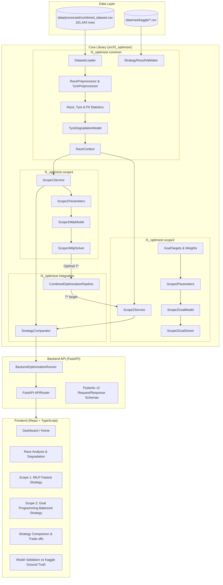

# System Architecture Reference

**Formula 1 Race Strategy & Performance Optimization**  
Operations Research Course Project — Team B13  

---

## 1. High-Level Architectural Diagram



---

## 2. Directory Index & Module Responsibility

```
F1-Race-Data-Optimization/
│
├── frontend/                               # React + TypeScript UI
│   ├── src/
│   │   ├── components/                     # Reusable UI widgets (timelines, charts, selectors)
│   │   ├── pages/                          # Primary view screens (Dashboard, Scope1, Scope2, Compare)
│   │   ├── layouts/                        # Header, sidebar, and layout wrappers
│   │   ├── hooks/                          # Custom React hooks (useRaceData, useOptimization)
│   │   ├── services/                       # API communication clients
│   │   ├── types/                          # TypeScript interface contracts
│   │   └── utils/                          # Frontend helpers & formatting
│   ├── package.json
│   └── README.md
│
├── backend/                                # FastAPI Web Service
│   ├── app/
│   │   ├── api/                            # REST route definitions
│   │   ├── schemas/                        # API request and response models
│   │   ├── services/                       # API runner delegating to f1_optimizer
│   │   ├── core/                           # API configuration and settings
│   │   └── main.py                         # Application entrypoint & middleware
│   └── README.md
│
├── src/f1_optimizer/                       # Core Operations Research Package
│   ├── common/                             # Shared by BOTH scopes
│   │   ├── data/                           # DatasetLoader interface
│   │   ├── preprocessing/                  # Race and tyre filtering
│   │   ├── statistics/                     # Race, tyre, and pit-stop aggregations
│   │   ├── tyre/                           # Degradation regression and pace prediction
│   │   ├── race/                           # RaceContext definition
│   │   ├── validation/                     # Ground-truth validation logic
│   │   ├── schemas/                        # Common Pydantic models (Race, Strategy, Optimization)
│   │   └── utils/                          # Time parsing and formatting utilities
│   │
│   ├── scope1/                             # Scope 1: MILP Fastest Strategy
│   │   ├── model/                          # Scope1MilpModel formulation
│   │   ├── parameters/                     # Scope1Parameters container
│   │   ├── solver/                         # Scope1MilpSolver (PuLP wrapper)
│   │   ├── service/                        # Scope1Service coordinator
│   │   └── output/                         # Scope1OptimizationResult schema
│   │
│   ├── scope2/                             # Scope 2: Goal Programming Balanced Strategy
│   │   ├── model/                          # Scope2GoalModel formulation
│   │   ├── goals/                          # Goal targets and priority weights
│   │   ├── parameters/                     # Scope2Parameters container
│   │   ├── solver/                         # Scope2GoalSolver (PuLP wrapper)
│   │   ├── service/                        # Scope2Service coordinator
│   │   └── output/                         # Scope2OptimizationResult schema
│   │
│   ├── integration/                        # Bridge between Scope 1 and Scope 2
│   │   ├── comparator.py                   # StrategyComparator (deltas, trade-offs)
│   │   └── pipeline.py                     # CombinedOptimizationPipeline
│   │
│   └── config/                             # Central project settings (settings.py)
│
├── data/
│   ├── raw/                                # Kaggle tables & FastF1 extracts
│   ├── processed/                          # combined_dataset.csv (161,443 rows)
│   └── README.md
│
├── notebooks/                              # Offline Exploration & Validation
│   ├── exploration/
│   ├── validation/
│   └── experiments/
│
├── tests/                                  # Pytest Test Suites
│   ├── common/
│   ├── scope1/
│   ├── scope2/
│   └── integration/
│
├── docs/                                   # Architectural & Model Documentation
│   ├── CURRENT_PROJECT_ANALYSIS.md
│   ├── PROJECT_PLAN.md
│   ├── ARCHITECTURE.md
│   └── mathematical-models/
│
├── pyproject.toml                          # Python build config & dependencies (uv managed)
├── uv.lock                                 # Pinned dependency lockfile
├── .python-version                         # Python 3.12 pin
└── README.md
```

---

## 3. Communication Contracts

### Scope 1 to Scope 2 Pipeline Contract
Scope 1 produces the fastest race time $T^*$:
```python
Scope1OptimizationResult:
  minimum_predicted_race_time: float (T*)
  optimal_pit_laps: List[int]
  pit_stop_count: int
  stints: List[StintPlan]
```
The integration layer feeds $T^*$ into Scope 2 as Goal 1 target. All three targets are
"best achievable" values, not arbitrary or historical estimates -- $T^*$ and $R^*$ are
each the real solved optimum of their own goal in isolation (via a dedicated MILP/Goal
Programming solve), and $P^*$ is the user's own `max_pit_stops` input:
```python
GoalTargets:
  target_race_time_t_star = scope1_result.minimum_predicted_race_time        # T*: Model 1's solved optimum
  target_pit_stops_p_star = user_max_pit_stops                               # P*: user's max_pit_stops input directly
  target_degradation_d_star = min_achievable_risk_score                      # R*: solved via minimize_risk_only pass
                                                                               #     (BackendOptimizationRunner._get_min_achievable_risk_score)
```
`max_pit_stops` is also enforced as a genuine hard ceiling on total pit stops in Model 2
(on top of the existing `min_pit_stops` floor) -- see
`docs/mathematical-models/scope2_goal_programming.md` section 6 for the full list of
user inputs and what scope (Model 1 / Model 2 / both) each one applies to.

Scope 2 solves the Goal Program minimizing weighted deviations $Z = \sum w_k d_k^+$ and returns:
```python
Scope2OptimizationResult:
  balanced_race_time_seconds: float (T)
  time_delta_vs_fastest_seconds: float (T - T*)
  deviations: GoalDeviations (d1+, d2+, d3+)
```

---

## 4. Key Design Principles

1. **Isolation of Optimization Logic:** Neither FastAPI nor React contains mathematical programming code. All optimization logic is encapsulated within `f1_optimizer.scope1` and `f1_optimizer.scope2`.
2. **Zero Dataset Duplication:** The master dataset at `data/processed/combined_dataset.csv` is loaded once through `DatasetLoader`.
3. **Type Safety Across Stacks:** Pydantic v2 in Python mirrors TypeScript interfaces in React, guaranteeing contract compatibility.
4. **Reproducibility with `uv`:** Virtual environments and dependencies are locked in `uv.lock` with Python 3.12.
