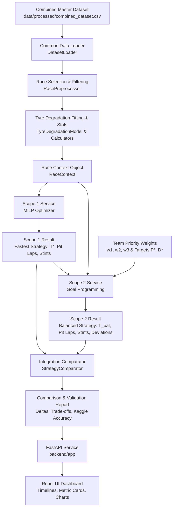

# Formula 1 Race Strategy & Performance Optimization: Master Project Plan

**Course:** Operations Research  
**Team:** B13 — Pranesh L, Kathir Velan M, Sasi Kumar P, Jeiesh S  
**Document Version:** 1.0.0 (Phase 1 — Architecture & Project Organization)  

---

## 1. Project Objective

The primary objective of this project is to apply Operations Research principles to optimize Formula 1 race strategies using historical timing, telemetry, and tyre degradation data. The system addresses two core optimization problems:
1. **Scope 1 — Integrated Tyre & Pit-Stop Strategy (MILP):** Find the single fastest theoretical race strategy by determining optimal pit-stop laps, tyre-compound selection for each stint, and minimum total predicted race time.
2. **Scope 2 — Multi-Objective Strategy Selection (Goal Programming):** Find a balanced, practical race strategy that balances competing strategic priorities (minimizing race time, minimizing pit-stop error risk, and conserving tyre life) using team-assigned priority weights.
3. **Validation & Delivery:** Validate predictions against actual race outcomes from the Kaggle Formula 1 historical database and present findings through an interactive React web dashboard backed by a FastAPI service.

---

## 2. Problem Definition

In Formula 1:
- A Grand Prix race covers a fixed distance of $N$ laps (typically 50–70 laps).
- Regulations require drivers to make at least one pit stop and run at least two different dry tyre compounds during a dry race.
- Teams select from three dry slick compounds: Soft (S), Medium (M), and Hard (H).
  - **Soft (S):** Fastest peak grip, but rapid thermal and surface degradation (usable life ~15–25 laps).
  - **Medium (M):** Balanced performance and degradation (~25–40 laps).
  - **Hard (H):** Slower baseline pace, but highest durability and wear resistance (~40–55+ laps).
- Every pit stop incurs a stationary tyre-change duration plus pit lane transit penalty (yielding a net track time loss $P \approx 13$–$20$ seconds), but resets the active tyre age to 0.

### The Decision Challenge
A race engineer must determine:
1. How many pit stops to execute ($\sum p_l \le 2$).
2. The specific laps $l$ on which to pit.
3. The compound $c$ fitted for each resulting stint.
4. How to trade off pure lap pace against pit-stop operational risk and compound degradation.

---

## 3. Dataset Architecture

The project consumes a single master dataset constructed by merging Kaggle historical records with FastF1 timing telemetry.

```
data/
├── raw/
│   ├── kaggle/                 # Historical tables (1950–2024): races, results, pit_stops, lap_times, drivers
│   └── fastf1/                 # Flat per-lap extracts (2018–2024): Compound, TyreLife, Stint, Position
└── processed/
    └── combined_dataset.csv    # Master joined dataset: 161,443 rows (2018–2024)
```

### Dataset Characteristics
- **Row Granularity:** One row per driver per lap.
- **Join Keys:** `[Year, Race Name, Driver Code, Lap Number]`.
- **Integrity Rule:** The dataset is already built and validated. It must **never** be rebuilt during regular application runs or duplicated in submodules.
- **Common Interface:** Both Scope 1 and Scope 2 access this data strictly through the common interface:
  `src/f1_optimizer/common/data/dataset_loader.py`.

---

## 4. Overall System Architecture

The architecture enforces strict separation of concerns across eight primary pillars:

```
┌────────────────────────────────────────────────────────────────────────┐
│                              PRESENTATION                              │
│                 React + TypeScript Single Page App (Vite)              │
│       Interactive Timelines, Strategy Comparison, Degradation Plots     │
└───────────────────────────────────┬────────────────────────────────────┘
                                    │ HTTP / REST API (JSON)
┌───────────────────────────────────▼────────────────────────────────────┐
│                             API / BACKEND                              │
│                      FastAPI Application (app/main.py)                 │
│         Route Handling, Request Schemas, Service Orchestration         │
└───────────────────────────────────┬────────────────────────────────────┘
                                    │ Direct Python Invocations
┌───────────────────────────────────▼────────────────────────────────────┐
│                        SHARED COMMON MODULE                            │
│                  f1_optimizer.common (Data, Preprocessing,             │
│            Statistics, Tyre Degradation, Validation, Schemas)          │
└───────────────────────────┬────────────────────────────────┬───────────┘
                            │                                │
            Parameters & Degradation         Parameters, Goals & T*
                            │                                │
┌───────────────────────────▼───────────┐    ┌───────────────▼───────────┐
│                SCOPE 1                │    │          SCOPE 2          │
│    Mixed-Integer Linear Program       │    │      Goal Programming     │
│       (MILP - Fastest Strategy)       │    │     (Balanced Strategy)   │
│                                       │    │                           │
│   min T_race = sum T_{l,c} + P*sum p  │    │   min Z = w1*d1+ +        │
│                                       │    │           w2*d2+ + w3*d3+ │
└───────────────────────────┬───────────┘    └───────────────┬───────────┘
                            │                                │
                      Fastest Result (T*)              Balanced Result
                            │                                │
┌───────────────────────────▼────────────────────────────────▼───────────┐
│                         INTEGRATION LAYER                              │
│     f1_optimizer.integration (StrategyComparator, CombinedPipeline)   │
│         Feeds T* from Scope 1 to Scope 2, Computes Deltas & Trade-offs │
└────────────────────────────────────────────────────────────────────────┘
```

---

## 5. Frontend Architecture (React + TypeScript)

The frontend is an interactive Operations Research dashboard built with **React**, **TypeScript**, and **Vite**.

### Principles
- **No Optimization Logic:** The frontend never executes mathematical models. It passes user parameters to the FastAPI backend and renders structured JSON results.
- **Modern Aesthetics & Ergonomics:** Visual timelines representing stints color-coded by compound (Soft = Red, Medium = Yellow, Hard = White), interactive weight sliders, degradation curves, and delta metric cards.

### Planned Screens & Components
1. **Home / Dashboard (`pages/DashboardPage.tsx`):**
   - Project introduction and OR problem summary.
   - Quick launcher for Scope 1 and Scope 2.
2. **Race Selection & Analysis (`pages/RaceAnalysisPage.tsx`):**
   - `RaceSelector`: Dynamic cascading selectors (Season $\rightarrow$ Race $\rightarrow$ Driver).
   - `RaceSummary`: Lap total, circuit info, historical winner.
   - `TyreDegradationChart`: Scatter plots of empirical lap times with regression degradation slopes.
   - `PitStopTimeline`: Historical pit stop timing distribution.
3. **Scope 1 — Fastest Strategy (`pages/Scope1Page.tsx`):**
   - Inputs: Total laps $N$, pit loss $P$, max stops, compound durability limits.
   - Outputs: `StrategyTimeline` showing optimal stint breakdown, optimal pit laps, and minimum predicted race time $T^*$.
4. **Scope 2 — Balanced Strategy (`pages/Scope2Page.tsx`):**
   - Inputs: Priority weight sliders ($w_1, w_2, w_3$), target pit stops $P^*$, target wear $D^*$.
   - Outputs: Balanced strategy timeline, deviation breakdowns ($d_1^+, d_2^+, d_3^+$), penalty objective $Z$.
5. **Strategy Comparison (`pages/ComparisonPage.tsx`):**
   - `StrategyComparison`: Side-by-side comparison matrix showing time trade-off (+seconds vs pit stops saved vs tyre wear conserved).
6. **Model Validation (`pages/ValidationPage.tsx`):**
   - `ValidationPanel`: Compares predicted optimal time and stints against actual historical finish from Kaggle `results.csv`.

---

## 6. Backend Architecture (FastAPI)

The backend acts as a thin, type-safe API bridge.
- **Framework:** FastAPI with Uvicorn.
- **Validation:** Pydantic v2 schemas.
- **Independence:** Route handlers only validate payloads and delegate to `f1_optimizer` services.

### Planned Endpoints
- `GET /api/health`: Health status.
- `GET /api/races/seasons`: List of available seasons (2018–2024).
- `GET /api/races?year={year}`: List of Grand Prix events for a season.
- `GET /api/races/{year}/{race_name}/drivers`: Competitors in that race.
- `GET /api/races/{year}/{race_name}/analysis`: Empirical degradation slopes, baseline lap times, and pit-stop metrics.
- `POST /api/scope1/optimize`: Invokes Scope 1 MILP.
- `POST /api/scope2/optimize`: Invokes Scope 2 Goal Programming.
- `POST /api/compare`: Executes combined pipeline and returns side-by-side trade-offs.
- `GET /api/validation/{year}/{race_name}/{driver}`: Compares predictions against ground truth.

---

## 7. Common Module Architecture (`src/f1_optimizer/common/`)

Shared components belong exclusively in `f1_optimizer.common`:
- `data/dataset_loader.py`: Singleton/cached dataset reader for `combined_dataset.csv`.
- `preprocessing/race_preprocessor.py`: Filters by race/driver, removes safety car laps and pit in/out outliers.
- `preprocessing/tyre_preprocessor.py`: Maps legacy compound names (e.g. ULTRASOFT $\rightarrow$ SOFT) and filters wet sessions.
- `statistics/`: Computes empirical stint distributions, race pace statistics, and pit stop time loss.
- `tyre/degradation_model.py`: Fits linear/polynomial tyre degradation curves:
  $$\text{LapTime}(age) = T_{\text{base}, c} + \alpha_c \cdot age$$
- `race/race_context.py`: Encapsulates race parameters ($N$, available compounds, fitted slopes, pit loss).
- `validation/result_validator.py`: Compares predicted strategy results with Kaggle `results.csv`.
- `schemas/`: Pydantic data contracts (`race.py`, `strategy.py`, `optimization.py`).
- `utils/time_utils.py`: Converts between lap time strings (`M:SS.sss`) and float seconds.

---

## 8. Scope 1 Architecture (`src/f1_optimizer/scope1/`)

Scope 1 solves Problem 1 from PPT Slides 9–11.

### Mathematical Formulation
**Sets:**
- $l \in \{1, \dots, N\}$: Race lap indices
- $c \in \{S, M, H\}$: Available tyre compounds

**Decision Variables:**
- $x_{l,c} \in \{0, 1\}$: Equals 1 if compound $c$ is fitted on lap $l$, 0 otherwise.
- $p_l \in \{0, 1\}$: Equals 1 if a pit stop occurs at the end of lap $l$, 0 otherwise.

**Parameters:**
- $T_{l,c}$: Predicted lap time on compound $c$ at current tyre age.
- $P$: Fixed pit-stop time loss ($P \approx 13$ seconds).
- $L_c^{\max}$: Maximum durable stint length for compound $c$ (e.g., Soft: 25, Med: 40, Hard: 55).
- $N$: Total race laps.

**Objective Function:**
$$\min T_{\text{race}} = \sum_{l=1}^N \sum_{c} T_{l,c} \cdot x_{l,c} + P \sum_{l=1}^N p_l$$

**Constraints:**
1. Exactly one compound active per lap:
   $$\sum_{c} x_{l,c} = 1 \quad \forall l \in \{1, \dots, N\}$$
2. Maximum pit stops allowed:
   $$\sum_{l=1}^N p_l \le 2$$
3. Tyre durability constraint:
   $$\text{TyreAge}_{l,c} \le L_c^{\max} \quad \forall l, c$$
4. Minimum stint length:
   $$\text{stint length} \ge 5$$
5. Total race coverage:
   $$\sum_i \text{stint}_i = N$$
6. Binary domain:
   $$x_{l,c} \in \{0, 1\}, \quad p_l \in \{0, 1\}$$

### Component Hierarchy
- `parameters/scope1_parameters.py`: Input dataclass for Scope 1.
- `model/milp_model.py`: Model formulation and constraint definition.
- `solver/milp_solver.py`: PuLP solver driver.
- `output/scope1_result.py`: Structured result containing optimal pit laps, stints, and $T^*$.
- `service/scope1_service.py`: Orchestrator converting `RaceContext` into `Scope1Parameters` and executing the solve.

---

## 9. Scope 2 Architecture (`src/f1_optimizer/scope2/`)

Scope 2 solves Problem 2 from PPT Slides 12–14.

### Mathematical Formulation
Real teams balance speed, pit-stop operational risk, and tyre degradation.

**Decision Variables:**
- $x_{l,c} \in \{0, 1\}$: Compound assignment.
- $p_l \in \{0, 1\}$: Pit stop decisions.
- $d_1^+, d_1^-$: Time goal over- and under-achievement deviations.
- $d_2^+, d_2^-$: Pit stop goal over- and under-achievement deviations.
- $d_3^+, d_3^-$: Tyre degradation goal over- and under-achievement deviations.

**Goals:**
1. **Goal 1 (Race Time):**
   $$T + d_1^- - d_1^+ = T^*$$
   Where $T^*$ is the fastest possible race time obtained from Scope 1.
2. **Goal 2 (Pit-Stop Count):**
   $$P_{\text{stops}} + d_2^- - d_2^+ = P^*$$
   Where $P^*$ is the target pit-stop count (e.g., 1 stop).
3. **Goal 3 (Tyre Degradation):**
   $$D_{\text{deg}} + d_3^- - d_3^+ = D^*$$
   Where $D^*$ is the target degradation index/rate.

**Objective Function:**
$$\min Z = w_1 d_1^+ + w_2 d_2^+ + w_3 d_3^+$$
Where $w_1, w_2, w_3 \ge 0$ are team-assigned priority weights (e.g. $w_1 = 0.50, w_2 = 0.25, w_3 = 0.25$).

### Component Hierarchy
- `goals/weights.py`: Priority weights container ($w_1, w_2, w_3$).
- `goals/goal_definitions.py`: Targets ($T^*, P^*, D^*$) and deviation variables ($d_k^+, d_k^-$).
- `parameters/scope2_parameters.py`: Complete Scope 2 parameter set.
- `model/goal_model.py`: Goal Programming formulation with soft goal constraints.
- `solver/goal_solver.py`: PuLP solver driver.
- `output/scope2_result.py`: Balanced strategy results with deviation metrics.
- `service/scope2_service.py`: Service coordinator.

---

## 10. Integration Architecture (`src/f1_optimizer/integration/`)

The integration module coordinates both scopes:
1. `pipeline.py`:
   - Runs `Scope1Service` on a given `RaceContext` to find fastest time $T^*$.
   - Feeds $T^*$ into `Scope2Service` as the Goal 1 target.
   - Solves `Scope2Service` using selected priority weights.
2. `comparator.py`:
   - Calculates time penalty delta $\Delta T = T_{\text{Scope2}} - T^*$.
   - Calculates pit stops saved $\Delta P = P_{\text{Scope1}} - P_{\text{Scope2}}$.
   - Calculates degradation conservation delta.
   - Generates natural language summary of trade-offs.

---

## 11. End-to-End Data Flow



---

## 12. Mathematical Model Implementation Plan

### Stint Formulation Strategy for MILP
In lap-by-lap MILP models, tracking tyre age linearly ($\text{TyreAge}_{l,c}$) can introduce non-linearities if age resets conditionally upon pit stops. To maintain pure linear constraints (MILP), two standard OR formulations exist:
1. **Stint-Indexed Formulation:** Define decision variables over feasible stints $s = (c, l_{\text{start}}, l_{\text{end}})$ with precomputed duration $\text{Cost}(s)$, reducing the problem to an exact shortest path / set partitioning problem over a Directed Acyclic Graph (DAG). This is completely linear and solves in under 1 second.
2. **Lap-State MILP Formulation with Stint Reset Variables:** Define cumulative stint tracking variables with Big-M constraints linking compound switches and pit stops ($p_l \ge x_{l,c} - x_{l+1,c}$).

Both approaches will be documented and evaluated in Phase 3.

---

## 13. Solver Plan

### Selected Solver Library: **PuLP**
- **Rationale:**
  1. **Course Standard:** PuLP is the gold standard in academic Operations Research courses for LP, MILP, and Goal Programming.
  2. **Solver Flexibility:** PuLP supports multiple robust solvers out of the box (COIN-OR CBC, HiGHS, GLPK, Gurobi, CPLEX).
  3. **Pure Linear Model Support:** Both Scope 1 (MILP) and Scope 2 (Goal Programming with linear deviations) are linear integer programs, for which PuLP is purpose-built.
  4. **No Heavy External System Dependencies:** CBC comes pre-bundled with PuLP on Linux x86_64, eliminating complex native solver compilation.
- **Alternative Evaluated:** `scipy.optimize.milp` (uses HiGHS internally). While SciPy is also included in our environment, PuLP provides symbolic variable and constraint naming (`x[lap, compound]`), making mathematical formulations legible and educational.

---

## 14. Validation Plan

To validate predictions against historical reality:
1. **Ground Truth Source:** Kaggle `results.csv` (actual driver race times, finish status) and `pit_stops.csv` (actual pit stop laps and durations).
2. **Validation Metrics:**
   - **Total Race Time Error:**
     $$\text{Error}_{\text{time}} = \frac{|T_{\text{predicted}} - T_{\text{actual}}|}{T_{\text{actual}}} \times 100\%$$
   - **Pit Stop Count Concordance:** Matches actual stops made by the winner / target driver.
   - **Stint Structure Accuracy:** Comparison of predicted tyre transition laps with actual driver pit window.
3. **Filtering Out Disrupted Races:** Races with extensive Red Flags or safety cars will be flagged, as safety cars compress deltas.

---

## 15. Testing Plan

The test suite will reside in `tests/`:
- `tests/common/`:
  - Lap time string to seconds conversion (`time_utils.py`).
  - Dataset loading integrity and schema completeness (`dataset_loader.py`).
  - Preprocessor outlier filtering (`race_preprocessor.py`).
  - Degradation curve fitting monotonicity ($\alpha \ge 0$).
- `tests/scope1/`:
  - MILP feasibility on standard races (e.g. 58-lap Melbourne).
  - Pit stop cap verification ($\sum p_l \le 2$).
  - Minimum stint length verification ($\ge 5$).
  - Durability bound enforcement ($\text{stint}_c \le L_c^{\max}$).
- `tests/scope2/`:
  - Goal Programming deviation non-negativity ($d_k^+, d_k^- \ge 0$).
  - Boundedness: $T \ge T^*$ (balanced strategy cannot be faster than the unconstrained fastest).
  - Weight sensitivity: increasing $w_2$ reduces pit stop frequency.
- `tests/integration/`:
  - End-to-end pipeline execution ($T^*$ feed-forward).
  - Strategy comparator metric consistency.
- `tests/api/`:
  - FastAPI endpoint response validation using `httpx`.

---

## 16. Open Questions / Model Decisions (PPT Ambiguities)

The project presentation contains several natural ambiguities that must be formally resolved prior to model implementation:

1. **Pit-Stop Cost Ambiguity ($P$):**
   - *PPT Slide 2 (Background):* States pit stop costs $\approx 20$ seconds (entry + tyre change + exit).
   - *PPT Slide 10 (MILP Formulation):* Explicitly defines parameter $P$ as fixed pit-stop time loss $\approx 13$ seconds.
   - *Decision for Implementation:* Make $P$ a configurable parameter in `RaceContext` (defaulting to 13.0s as specified in the MILP formulation slide, with ability to test sensitivity at 20.0s).
2. **Scope 2 Multi-Objective Formulation vs Motivation:**
   - *PPT Slide 12 (Motivation):* Mentions four competing priorities: race time, pit-stop count, tyre degradation, and **risk**.
   - *PPT Slides 13–14 (Mathematical Formulation):* Formulates exactly **three** goals:
     - Goal 1: Time ($T$)
     - Goal 2: Pit stops ($P$)
     - Goal 3: Degradation ($D$)
   - *Decision for Implementation:* Strictly implement the three explicit mathematical goals in the primary Goal Programming formulation ($w_1, w_2, w_3$). Pit-stop operational risk is effectively proxied by Goal 2 (fewer stops reduces pit-lane failure risk).
3. **Tyre Degradation Modeling ($T_{l,c}$ and $D$):**
   - The PPT assumes $T_{l,c}$ and $D^*$ are given.
   - *Decision for Implementation:* The empirical degradation function must be fitted directly from `data/processed/combined_dataset.csv`. In Phase 2, regression models will fit baseline pace and degradation slope $\alpha_c$ per compound per circuit.

---

## 17. Future Implementation Phases

Implementation is planned across six sequential phases:

| Phase | Title | Scope of Work |
| :--- | :--- | :--- |
| **Phase 1** | **Architecture & Organization** | *(Current Phase)* Repository structure, uv environment, Pydantic schemas, docs, testing skeleton. |
| **Phase 2** | **Data Processing & Common Layer** | Implement `DatasetLoader`, `RacePreprocessor`, `TyrePreprocessor`, degradation curve fitting, and time utilities. |
| **Phase 3** | **Scope 1 — MILP Model** | Implement MILP formulation in PuLP, parameters extraction, solver execution, and unit tests. |
| **Phase 4** | **Scope 2 — Goal Programming** | Implement Goal Programming formulation in PuLP, goal targets, priority weights, and unit tests. |
| **Phase 5** | **Integration & Validation** | Implement `StrategyComparator`, end-to-end pipeline, and historical validation against Kaggle `results.csv`. |
| **Phase 6** | **FastAPI Backend & React UI** | Implement REST API routes and build the React + TypeScript frontend dashboard with visual charts. |
